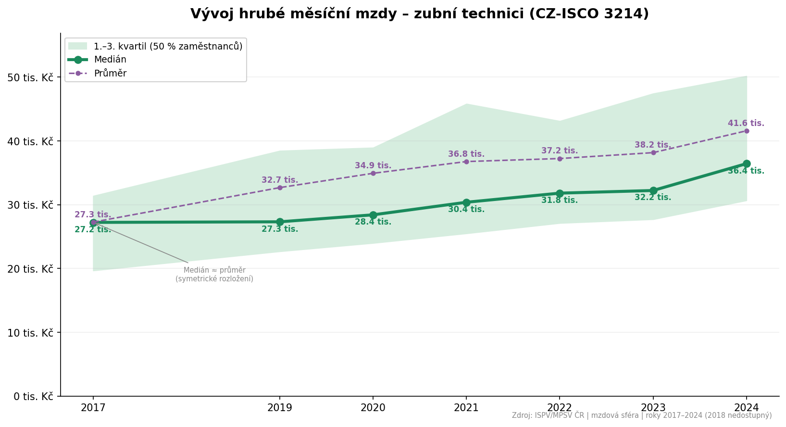
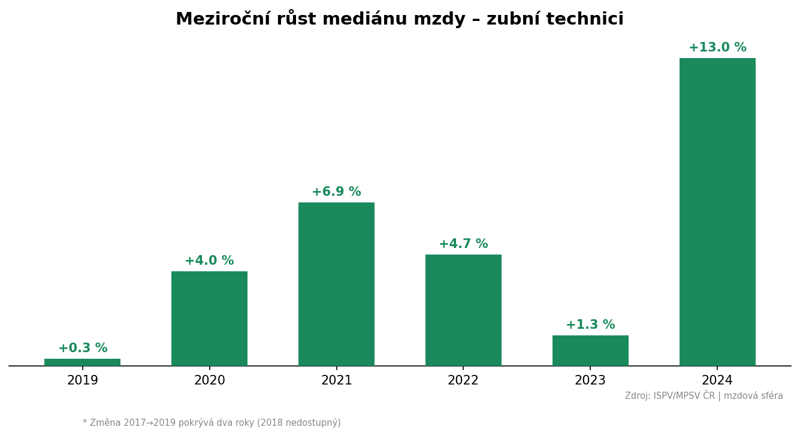

# dental-technician-salary-analysis-cz
Analysis of gross monthly wages for dental technicians (CZ-ISCO 3214) based on publicly available data from ISPV/MPSV (Czech Ministry of Labour and Social Affairs).
# === Vygenerování README.md ===

readme_cz = """# Vývoj platů zubních techniků v ČR (2017–2024)

Analýza vývoje hrubých měsíčních mezd odborných pracovníků v oblasti zubní techniky 
(CZ-ISCO 3214) na základě veřejně dostupných dat ISPV/MPSV ČR.



## Hlavní zjištění

- **Medián mzdy** vzrostl z 27,2 tis. Kč (2017) na 36,4 tis. Kč (2024), tedy o 34 %
- **Průměrná mzda** rostla rychleji (52 %) – v roce 2024 činí 41,6 tis. Kč
- Rostoucí rozdíl mezi průměrem a mediánem naznačuje **zvyšující se nerovnost** v odměňování
- Největší meziroční skok nastal v roce **2024 (+13 %)**
- Rok **2018** není v datech dostupný (pravděpodobně nedostatečná velikost vzorku)



## Zdroj dat

[ISPV – Informační systém o průměrném výdělku](https://www.mpsv.cz/ispv), 
publikace Ministerstva práce a sociálních věcí ČR.

- Období: 2017–2024 (celé roky, mzdová sféra)
- Klasifikace: CZ-ISCO 3214 – Odborní pracovníci v oblasti zubní techniky
- Tabulka: MZS-M8 (hrubá měsíční mzda podle podskupin zaměstnání)

## Struktura projektu
```
├── vyvoj_platu_zubni_technik.ipynb   # hlavní notebook s analýzou
├── data/
│   ├── zubni_technik_2017_2024.csv   # vyextrahovaná data
│   ├── graf_zubni_technik.png        # graf vývoje mezd
│   └── graf_meziroční_zmeny.png      # graf meziročních změn
└── README.md
```

## Metodologie

1. **Sběr dat** – automatické stažení 8 publikací ISPV z webu MPSV (roky 2017–2024)
2. **Extrakce** – vyhledání kódu CZ-ISCO 3214 v tabulce MZS-M8 každého souboru
3. **Analýza** – výpočet meziročních změn, porovnání mediánu a průměru
4. **Vizualizace** – časová řada s kvartilovou distribucí, sloupcový graf změn

## Použité technologie

- Python 3, pandas, matplotlib
- Google Colab

## Slovníček pojmů v grafech

| Český termín | Význam |
|---|---|
| Hrubá měsíční mzda | Gross monthly wage |
| Medián | Median – střední hodnota (50 % vydělává méně, 50 % více) |
| Průměr | Mean – aritmetický průměr |
| 1.–3. kvartil | Interquartile range – pásmo, ve kterém se pohybuje 50 % zaměstnanců |
| tis. Kč | Thousands of CZK |
| Meziroční růst | Year-over-year growth |

## Autor

Projekt vznikl jako součást kurzu Datová analýza v Pythonu ([BeeIT](https://beeit.cz)).
"""

with open("README.md", "w", encoding="utf-8") as f:
    f.write(readme_cz)

print("✓ README.md vytvořeno")

# Dental Technician Salary Analysis – Czech Republic (2017–2024)

Analysis of gross monthly wages for dental technicians (CZ-ISCO 3214) based on publicly available data from ISPV/MPSV (Czech Ministry of Labour and Social Affairs).


## Key Findings

- **Median wage** grew from 27,200 CZK to 36,400 CZK (+34%) over the observed period
- **Mean wage** grew faster (+52%), reaching 41,600 CZK in 2024
- The widening gap between mean and median suggests **increasing wage inequality** – a minority of specialists earn significantly more
- The largest year-over-year increase occurred in **2024 (+13%)**
- **2018** data is unavailable (likely due to insufficient sample size)


## Chart Labels Guide

Since charts use Czech labels (targeting the Czech labour market), here is a quick reference:

| Czech label | English meaning |
|---|---|
| Hrubá měsíční mzda | Gross monthly wage |
| Medián | Median |
| Průměr | Mean (average) |
| 1.–3. kvartil | Interquartile range (middle 50% of employees) |
| tis. Kč | Thousands of CZK (~1 CZK ≈ 0.04 EUR) |
| Meziroční růst | Year-over-year growth |
| Zdroj | Source |

## Data Source

[ISPV – Information System on Average Earnings](https://www.mpsv.cz/ispv), published by the Czech Ministry of Labour and Social Affairs.

- Period: 2017–2024 (full-year reports, private sector)
- Classification: CZ-ISCO 3214 – Dental technicians
- Table: MZS-M8 (gross monthly wages by occupation subgroups)

## Methodology

1. **Data collection** – automated download of 8 ISPV publications from the MPSV website
2. **Extraction** – locating CZ-ISCO code 3214 in table MZS-M8 of each file
3. **Analysis** – year-over-year changes, median vs. mean comparison
4. **Visualization** – time series with interquartile distribution, bar chart of annual changes

## Project Structure
```
├── vyvoj_platu_zubni_technik.ipynb   # main analysis notebook
├── data/
│   ├── zubni_technik_2017_2024.csv   # extracted data
│   ├── graf_zubni_technik.png        # salary trends chart
│   └── graf_meziroční_zmeny.png      # YoY changes chart
├── README.md                          # Czech version
└── README_EN.md                       # English version
```

## Tech Stack

- Python 3, pandas, matplotlib
- Google Colab

---

**Jak to použiješ na GitHubu:** `README.md` bude česká verze (tu uvidí každý automaticky). Na konec české verze přidej řádek:
```
🇬🇧 [English version](README_EN.md)
```

A na konec anglické verze:
```
🇨🇿 [Česká verze](README.md)